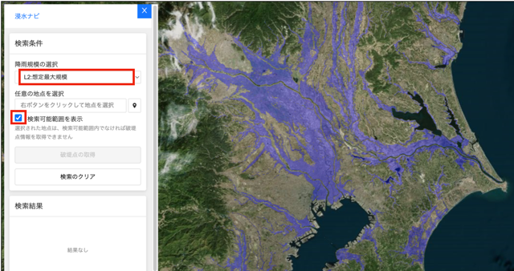
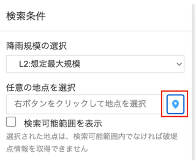
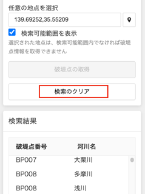

> **NOTE：English text is below**

# 浸水ナビプラグイン
  

## このプラグインについて

国土地理院によって公開されている「浸水ナビ（[リンク](https://suiboumap.gsi.go.jp/)）」の APIから浸水シミュレーションのデータを読み込み、表示するプラグインです。指定した破堤点からの浸水域を表示したり、経過時間による変化を表示することも可能です。

- 出典 
  - 浸水ナビ (https://suiboumap.gsi.go.jp/) 
  - 地理院タイル （破堤点別時系列タイル・洪水浸水想定区域図検索可能範囲）を加工して作成

## 使用方法

- 検索可能範囲の表示

  プラグイン内の「降雨規模の選択」からシミュレーションの想定規模を選択します。「検索可能範囲を表示」をチェックすると検索可能範囲が青く表示されます。検索可能範囲内の浸水情報が取得可能です。

  

- シミュレーションする地点の指定

  「任意の地点を選択」項目のアイコンをクリックします。クリックするとアイコンは青くなります。
  
  

  この状態で、地図上の任意の点をダブルクリックすると、赤色のマーカーが配置され、その場所の座標が入力されます。

  

- 破堤点の取得

  「破堤点の取得」ボタンをクリックすると、指定した地点に対するシミュレーション可能な破堤点を取得します。取得した破堤点は検索結果にリスト表示するとともに、地図上にマーカーを配置します。赤色のマーカーは最大浸水破堤点です。

    　※破堤点読み込みには地点によって数十秒〜数分かかる場合があります。

  

  破堤点をクリックすると、その破堤点の情報がインフォボックスに表示されます。

  

- シミュレーション

  検索結果から、破堤点を選ぶと、地図上のマーカーが青色から、黄色に変わります。この後「浸水シミュレーション実行」ボタンをクリックすると浸水シミュレーションの画面が表示されます。

  

- シミュレーション操作

   シミュレーション画面では、「再生」、「ポーズ」ボタンが利用できます。またタイムスライダーで任意の時間に移動することも可能です。

    

- 検索結果のクリア。

   「検索のクリア」ボタンをクリックすると、破堤点の検索結果をクリアすることができます。

  

## 備考

このプラグインは、以下のOS,ブラウザで動作確認をしています。

- OS
  - Mac OS Sonoma  14.5

- ブラウザ
  - Chrome: 126.0.6478.127

## 変更履歴
  - 破堤点が重複して表示される不具合を修正しました。
  - デザインを見直し、より直感的なUIに変更しました。

## 重要事項

　　本プラグインを使用したことにより生じたいかなる損害についても、弊社は一切の責任を負いません。

## 開発者欄

このプラグインは、Re:Earth公式プラグインです。

 

ソースコードはこちら(https://github.com/eukarya-inc/reearth-plugin-shinsuiNavi)

- コミュニティ

  - このプラグインを利用したプロジェクトをユーザーコミュニティでシェアしましょう。

  - このプラグインについての不明点がある場合にもここからRe:Earthチームや他の開発者に質問することができます。

  - Discordへのリンクはこちら(https://discord.gg/BXcQhvwqqM)

---

# Shinsui-Navi plugin

  

## About this plugin

This plug-in reads and displays inundation simulation data from the API of "Inundation Navi ([link](https://suiboumap.gsi.go.jp/))" published by the Geospatial Information Authority of Japan. It is also possible to display the inundation area from the specified breakwater point and changes over time.

- Source. 
  - Inundation Navigation (https://suiboumap.gsi.go.jp/) 
  - Created by processing Geographical Survey Institute tiles (time series tiles by levee break point and searchable area of expected flood inundation area map)

## How to operate

- Display of searchable range

  Select the expected scale of the simulation from "Select Rainfall Scale" in the plug-in. When "Show searchable area" is checked, the searchable area is displayed in blue. The inundation information within the searchable area can be obtained.

  

- Specify the location to be simulated

  Click on the icon in the "Select any point(任意の地点を選択)" field. The icon turns blue when clicked.
  
  

  In this state, double-clicking any point on the map will place a red marker and enter the coordinates of that location.

  

- Obtaining breakwater points

  Clicking on the "Get Breakwater Points(破堤点の取得)" button will retrieve the simulated breakwater points for the specified point. The acquired breakwater points are listed in the search results, and markers are placed on the map. The red markers are the maximum inundation break points.

    　*Note: Breakpoint loading may take tens of seconds to several minutes depending on the location.

  

  Clicking on a breakwater point displays information about that breakwater point in the infobox.

  

- Simulation

  Select a levee break point from the search results, and the marker on the map will change from blue to yellow. After this, click the "Run Inundation Simulation( 浸水シミュレーション実行)" button to display the inundation simulation screen.

  

- Simulation Operation

   On the simulation screen, "Play" and "Pause" buttons are available. It is also possible to move to any time with the time slider.

    

- Clear the search result

   Click the "Clear Search(検索のクリア)" button to clear the search results for the breakwater point.

  

## Additional Information

This plug-in has been tested on the following OS and browsers.

- OS
  - Mac OS Sonoma  14.5

- Browser
  - Chrome: 126.0.6478.127

## Change Log
  - Fixed a bug that caused duplicate breakwater points to be displayed.
  - The design has been reviewed and changed to a more intuitive UI.

## IMPORTANT INFORMATION

　 - WE TAKE NO RESPONSIBILITY FOR ANY DAMAGE CAUSED BY THE USE OF THIS PLUGIN.

## For Developer
- This is an official Re:Earth plugin.

  

The source code is here (https://github.com/eukarya-inc/reearth-plugin-shinsuiNavi)

- Community

  Re:Earth user community is always welcome to your contribution to share your project developed with this plugin.
  If you have any questions about this plugin, you can ask the Re:Earth development team and other developers on [Discord](https://discord.gg/BXcQhvwqqM).
